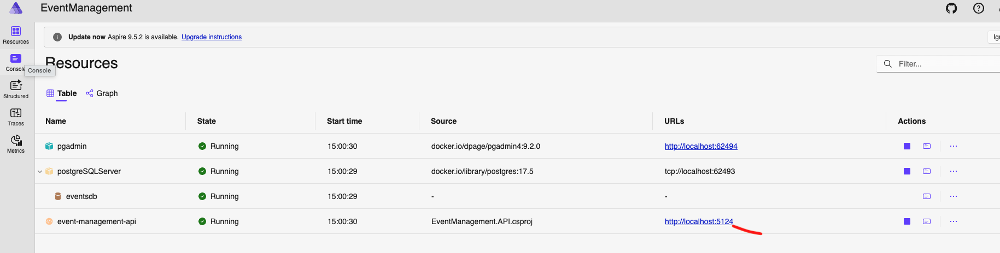
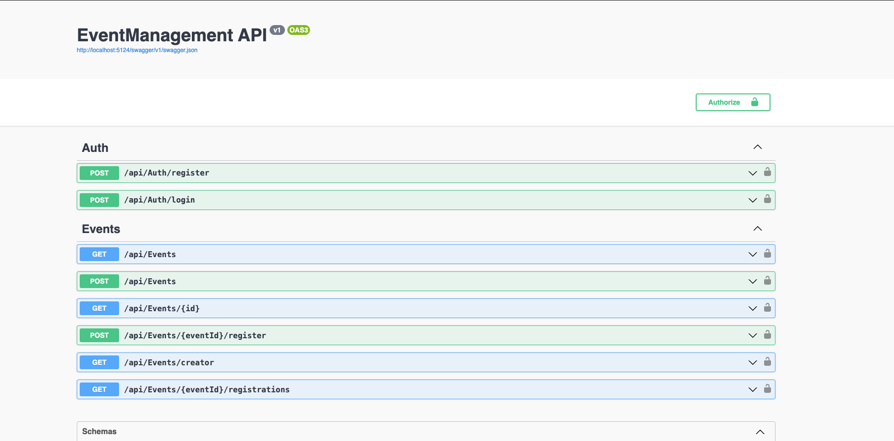
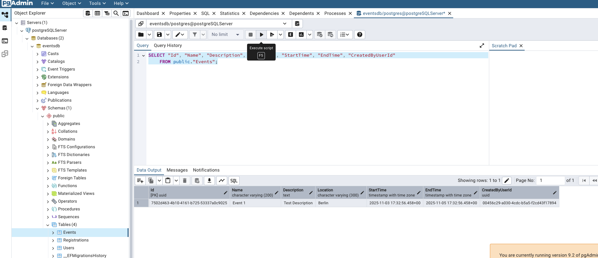

# 🎟️ Event Management API

A lightweight event management platform built with **.NET 9**, **Clean Architecture**, and **CQRS**.  
Event creators can create events, and participants can browse and register easily.

---

## 📌 Overview

### **User Roles**
- **Event Creators (Authenticated)**
    - Create events
    - View registrations for their own events

- **Event Participants (Public)**
    - Browse all events
    - Register without logging in

### **Event Fields**
- Name
- Description
- Location
- Start Time
- End Time

### **Registration Fields**
- Name
- Phone Number
- Email Address

---

## 🛠️ Tech Stack

- **.NET 9 / ASP.NET Core** – modern, fast, cross-platform
- **Clean Architecture** – separation of concerns & testability
- **CQRS + MediatR** – structured command/query pipelines
- **EF Core** – ORM with migrations support
- **PostgreSQL** – relational database
- **JWT Authentication** – secure, stateless login for creators
- **FluentValidation** – clean validation rules
- **EF Core InMemory** – fast unit testing
- **TestContainers** – realistic integration testing
- **.NET Aspire** – local dev orchestration

---

## 🏗️ Database Migrations

To add a new migration:

```bash
dotnet ef migrations add <MigrationName> --project EventManagement.Infrastructure --startup-project EventManagement.API
```

## 🚀 Running the Project Locally

Follow the steps below to run the Event Management API using **.NET Aspire**.
---

#### ✅ 1. Add JWT Key to User Secrets
#### ✅ 2. run the .net aspire (AppHost)
#### ✅ 3. click on the link to open the swagger page (http://localhost:5124/swagger/index.html)
#### ✅ 4. create a user and event
#### ✅ 4. check the database from pgadmin url in the .net aspire dashboard






